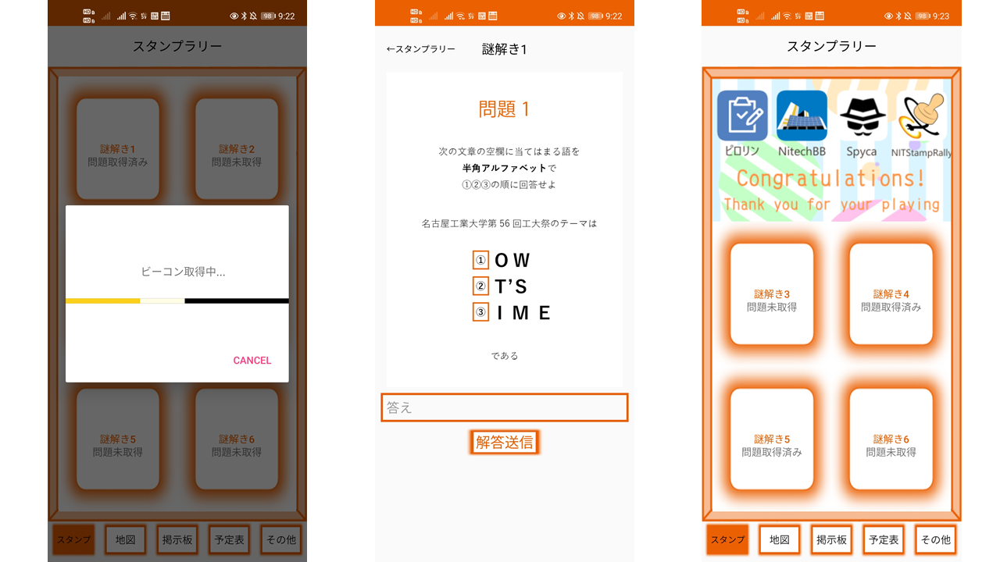

# Stamprally_app

## アプリケーション概要
- 学祭用の謎解きスタンプラリーアプリです．
- [現在、使用技術やアーキテクチャを見直してリファクタリング中です](https://github.com/taked137/Stamp_remake)

## 利用方法
- 全部で6つ存在するチェックポイント内で謎解きの問題を取得し，謎解きに正解することでスタンプが押されます．
  - チェックポイントは学祭地図中にピンで示されています．

## アプリケーションの目的
- 学祭の補助
  - スタンプラリー以外にも地図，掲示板，予定表などを表示
    - 実際の位置情報に基づいた校内案内が可能
    - 学祭のイベントを一つ残らず楽しんでもらう
- 学内の探検
  - 模擬店や出店が一部の個所に集中しているという問題があった
    - 学内の模擬店や出店が無い場所(古墳など)へ足を運ぶことがない
  - スタンプラリーという形でチェックポイントを設けることで大学をより知ってほしい

## アプリケーションの流れ
1. サーバから取得された利用規約に同意
2. ユーザ名(他ユーザとの重複不可)を入力しユーザ登録
3. ゲーム開始
4. 地図をもとにチェックポイントにたどり着く
5. 取得できたビーコン値とGPSの値をサーバに送信
6. チェックポイント内と判定されれば謎解きの問題を取得
7. 回答をサーバに送信し正解ならスタンプが押される
8. 4.以降を繰り返す

## スクリーンショット

